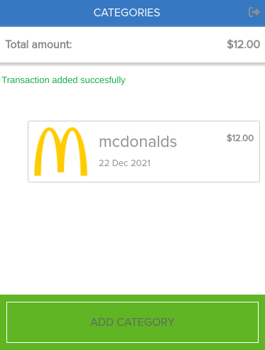

## Screenshot

## Live Demo

# YouSpent

This is a mobile web application where you can manage your budget: you have a list of transactions associated with a category, so that you can see how much money you spent and on what.

## Built With

- Ruby
- Rspec
- Rails
- PostgreSQL

## Getting Started

To get a local copy up and running follow these simple steps inside the root folder.

### Prerequisites

- [Ruby](https://www.ruby-lang.org/)
- [Ruby on Rails](https://rubyonrails.org/)

### Setup
- Clone or download this repo on your machine
- Enter project directory
- Run `bundle install` to install dependencies
- Run  `rails db:create` to create a database
- Run  `rails db:migrate` to create a database
- Run  `rails db:seed` to add dummy data

### Run

Run `rails s` to run the server and open `localhost:3000` in browser
- After seed you can login using: email: 'Test@user1.com', password: 'password'

### Test

Run `rspec` to run tests

## Author

👤 **Onesis Olea**

- Github: [2bleO](https://github.com/2bleO)
- Linkedin: [Onesis Olea](https://www.linkedin.com/in/onesis-olea/)
- Twitter: [@OleaOnesis](https://twitter.com/OleaOnesis)

## 🤝 Contributing

Contributions, issues and feature requests are welcome!

Feel free to check the [issues page](https://github.com/2bleO/Recipes/issues).

## Show your support

Give a ⭐️ if you like this project!

## Acknowledgments

- [Microverse](https://www.microverse.org/) 
- Original design idea by [Gregoire Vella](https://www.behance.net/gregoirevella)
- [Original design on Behance](https://www.behance.net/gallery/19759151/Snapscan-iOs-design-and-branding?tracking_source=)
- [Proxima Nova Font](https://www.freefontsfamily.com)

## 📝 License

This project is MIT Lisenced
